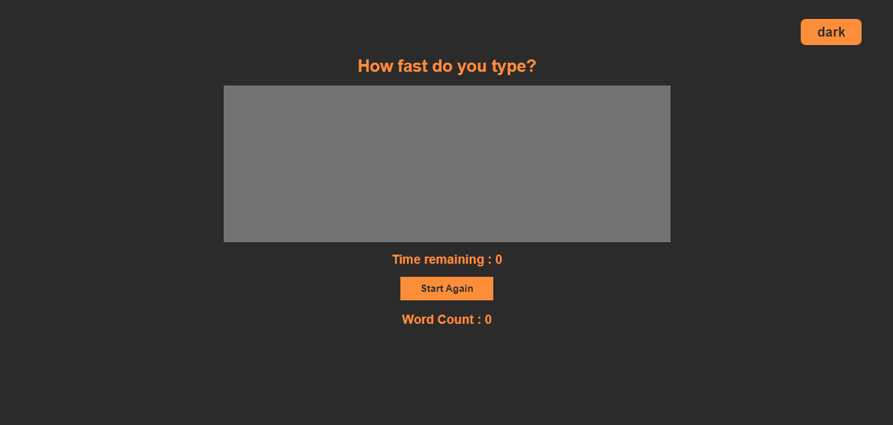
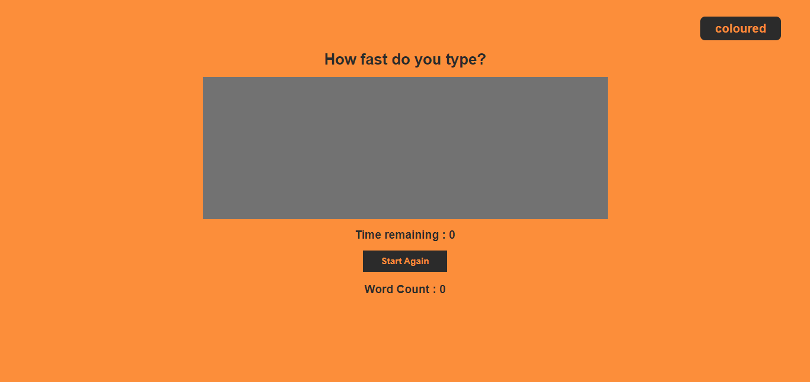

# Speed Typing Game

  ## Table of Content

 * [Overview of the Project](#overview-of-the-project)
      * [Screenshot](#screenshot)
 * [Technologies I Used](#technologies-i-used)
 * [What I Learned](#what-i-learned) 
 
# Overview of the Project

A fun App made with React to test your speed Typing Skills in a given time with a toggle theme feature.

## Screenshot

## Technologies I Used

* React

## What I Learned

- Learned about useState and useEffect functions.
- Learned about useRef.
- Learned about custom hooks.
- Learned about Theme Context and useContext and added a theme switcher. 
